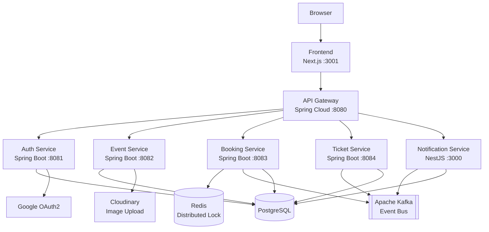

# SeatGuard — High-Concurrency Ticket Booking Platform

A full-stack ticket booking system that **prevents double-booking under concurrent traffic** using Redis distributed locks and PostgreSQL unique constraints. Built to demonstrate real concurrency control, not just claim it.

---

## Table of Contents

- [Tech Stack](#tech-stack)
- [Architecture](#architecture)
- [How It Works — User Flow](#how-it-works--user-flow)
- [Admin Features](#admin-features)
- [Security](#security)
- [Payment](#payment)
- [Concurrency Proof](#concurrency-proof)
- [Quick Start](#quick-start)
- [Environment Setup](#environment-setup)
- [Documentation](#documentation)
- [Screenshots](#screenshots)
- [Known Limitations](#known-limitations)
- [License](#license)

---

## Tech Stack

| Layer | Technology |
|-------|-----------|
| Frontend | React + Next.js 14 |
| API Gateway | Spring Cloud Gateway |
| Backend Services | Java 21 + Spring Boot 3.x |
| Notification Service | Node.js + NestJS |
| Database | PostgreSQL 16 |
| Cache / Distributed Lock | Redis 7 |
| Message Broker | Apache Kafka 3.7 (KRaft mode) |
| Image Upload | Cloudinary |
| Authentication | JWT + Google OAuth2 |
| Load Testing | k6 |
| Containerization | Docker Compose |

---

## Architecture



| Service | Port | Responsibility |
|---------|------|---------------|
| api-gateway | 8080 | Routing, rate limiting, auth filter |
| auth-service | 8081 | Register, login, JWT, Google OAuth2, refresh tokens |
| event-service | 8082 | Events, sections, seats, seat map, image upload |
| booking-service | 8083 | Seat hold (Redis lock), payment, cancellation |
| ticket-service | 8084 | Ticket issuance, QR code, check-in |
| notification-service | 3000 | WebSocket push, Kafka consumer |
| frontend | 3001 | Next.js web app |

---

## How It Works — User Flow

1. **Browse** — View upcoming events and seat maps
2. **Login** — Register or sign in via Google OAuth2
3. **Select Seat** — Pick an available seat from the interactive map
4. **Hold** — Seat is locked for 5 minutes via Redis `SET NX EX` (TTL-based)
5. **Pay** — Complete mock payment to confirm the booking
6. **Ticket** — QR-coded ticket is issued asynchronously via Kafka
7. **Check-in** — Scan QR at the door; duplicate check-in is rejected

---

## Admin Features

- **Event CRUD** — Create, update, and delete events with full seat map configuration
- **Image Upload** — Event cover images via Cloudinary (direct upload, no local storage)
- **RBAC Enforcement** — Admin-only endpoints protected at the gateway level; admin emails configured via `ADMIN_EMAILS` env var

---

## Security

- **JWT Authentication** — Short-lived access tokens + long-lived refresh tokens
- **Google OAuth2** — Social login as an alternative to password-based auth
- **Admin RBAC** — Role-based access control enforced on admin endpoints
- **Gateway-Only Architecture** — All service-to-service auth flows through the API gateway; internal services are not publicly exposed
- **Secrets in `.env` Only** — No hardcoded credentials; all secrets loaded from environment variables

---

## Payment

| Provider | Status | Notes |
|----------|--------|-------|
| Mock Payment | ✅ Active | Simulates success/failure for demo purposes |
> **Note:** The active demo uses the **Mock Payment** provider only. MoMo and VNPay backend adapters exist as sandbox-ready extension points but are hidden from the public demo UI.

---

## Concurrency Proof

The whole point of this project. Here's what happens when 100 virtual users try to book the **same seat** at the same time:

**Test:** `k6 run tests/k6/double-booking.js` — 100 VUs, 30s ramp

| Metric | Result |
|--------|--------|
| Total requests | 14,374 |
| Successful bookings | **1** |
| Conflict (409) | 14,364 |
| Unexpected errors | **0** |
| p95 latency | 427ms |
| p99 latency | ~500ms |

**DB verification:**

```sql
SELECT seat_id, status, COUNT(*) FROM bookings
WHERE status IN ('PENDING_PAYMENT', 'CONFIRMED')
GROUP BY seat_id, status HAVING COUNT(*) > 1;
-- Result: 0 rows — NO duplicate bookings
```

**Protection layers:**

1. **Redis `SET NX EX`** — First acquirer wins; others get rejected immediately
2. **PostgreSQL unique constraint** — Active booking per seat enforced at the DB level
3. **Idempotency key** — Same key returns existing booking, not a new one
4. **Application-level check** — `DuplicateBookingException` thrown before any write

---

## Quick Start

### Docker (Recommended)

```bash
# Start everything (10 containers)
docker compose -f infra/docker-compose.full.yml up -d

# Open the app
open http://localhost:3001

# Run smoke test
bash tests/smoke/full-flow.sh

# Run concurrency test
bash scripts/run-k6-double-booking.sh

# Stop everything
docker compose -f infra/docker-compose.full.yml down
```

### Local Development

```bash
# Infrastructure only
docker compose -f infra/docker-compose.yml up -d

# Backend services (separate terminals)
cd backend/api-gateway && mvn spring-boot:run
cd backend/auth-service && mvn spring-boot:run
cd backend/event-service && mvn spring-boot:run
cd backend/booking-service && mvn spring-boot:run
cd backend/ticket-service && mvn spring-boot:run

# Notification service
cd notification-service && npm install && npm run start:dev

# Frontend
cd frontend && npm install && npm run dev
```

---

## Environment Setup

```bash
# Copy the example file
cp .env.example .env

# Edit .env and fill in your values
# All CHANGE_ME placeholders must be replaced before running
```

**Required variables:**

| Variable | Description |
|----------|-------------|
| `POSTGRES_PASSWORD` | Database password |
| `JWT_SECRET` | Min 32 characters, random string |
| `GOOGLE_CLIENT_ID` | Google OAuth2 client ID |
| `GOOGLE_CLIENT_SECRET` | Google OAuth2 client secret |
| `CLOUDINARY_CLOUD_NAME` | Cloudinary cloud name |
| `CLOUDINARY_API_KEY` | Cloudinary API key |
| `CLOUDINARY_API_SECRET` | Cloudinary API secret |

> **Never commit `.env` to version control.** The `.env.example` file exists for this reason.

---

## Documentation

| Document | Description |
|----------|-------------|
| [docs/DEMO.md](docs/DEMO.md) | Step-by-step demo walkthrough |
| [docs/DEMO_CHECKLIST.md](docs/DEMO_CHECKLIST.md) | Pre-demo verification checklist |
| [reports/final-evidence-report.md](reports/final-evidence-report.md) | Full technical evidence and test results |
| `/proof` route | Live technical evidence page (run locally at http://localhost:3001/proof) |
| [docs/architecture.md](docs/architecture.md) | Detailed architecture documentation |
| [docs/api-contract.md](docs/api-contract.md) | API endpoints and contracts |
| [docs/database-design.md](docs/database-design.md) | Database schema and design |
| [docs/event-flow.md](docs/event-flow.md) | Event-driven flow documentation |
| [docs/testing-strategy.md](docs/testing-strategy.md) | Testing approach and strategy |
| [docs/roadmap.md](docs/roadmap.md) | Future improvements and roadmap |

> **Tip:** Run the app locally and visit [http://localhost:3001/proof](http://localhost:3001/proof) for live technical evidence including build results, API tests, and k6 load test results.

---

## Screenshots

> *Screenshots to be added — run the demo locally and capture:*
>
> - Event listing page
> - Interactive seat map
> - Booking flow (hold → pay → ticket)
> - Admin event management
> - k6 test results
> - QR ticket and check-in

---

## Known Limitations

Being honest about what this project is and isn't:

- **MoMo/VNPay are backend-only** — Provider adapters exist as future sandbox extension, hidden from the demo UI. Real integration requires merchant credentials + signing/IPN verification.
- **Real secrets are not committed** — `.env.example` has placeholders only. You need your own credentials.
- **Notification service is demo-grade** — WebSocket push works, but no retry logic, no dead-letter queue, no production error handling.
- **No CI/CD pipeline** — No GitHub Actions, no automated tests on push, no deployment automation.
- **No production deployment** — This runs on Docker Compose locally. No Kubernetes, no cloud hosting, no monitoring stack.

This is a portfolio project built to demonstrate concurrency control and system design skills, not a production-ready SaaS.

---

## License

Portfolio project — built for learning and demonstration purposes.
